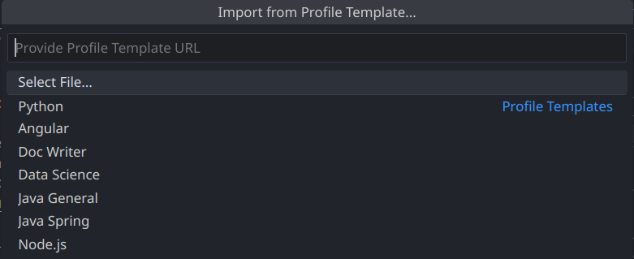

# vscode-settings

I have made a configuration in Visual Studio Code, where I have adjusted the theme, indentation and icons. This environment is optimized focused on efficiency and organization while working on my programming projects.

## Screenshots


## How to use this project

- clone this repository into your local machine.

```bash
    git clone https://github.com/RaulAntonioMoralesBarros/vscode-settings.git
```

- In visual studio code, go to File > Preferences > Profile > Import Profile

- A new window open, clic in Select File
  

- Import project profile.code-profile

## Extensions

- [Palenight Theme](https://marketplace.visualstudio.com/items?itemName=whizkydee.material-palenight-theme) - Style `Palenight Theme`.

  An elegant and juicy material-inspired theme for Visual Studio Code.

- [One dark pro](https://marketplace.visualstudio.com/items?itemName=zhuangtongfa.Material-theme) - Style `One dark pro Mix`.

  Atom's iconic One Dark theme, and one of the most installed themes for VS Code!

- [Indenticator](https://marketplace.visualstudio.com/items?itemName=SirTori.indenticator).

  Visually highlights the current indent depth.

- [Material icon theme](https://marketplace.visualstudio.com/items?itemName=PKief.material-icon-theme).

  You can change the color of the default file and folder icons

- [Prettier - code formatter](https://marketplace.visualstudio.com/items?itemName=esbenp.prettier-vscode).

  Prettier is an opinionated code formatter. It enforces a consistent style by parsing your code and re-printing it with its own rules that take the maximum line length into account, wrapping code when necessary.

- [Spanish Language Pack for Visual Studio Code](https://marketplace.visualstudio.com/items?itemName=MS-CEINTL.vscode-language-pack-es).

  El paquete de idioma español proporciona una experiencia de UI localizada para VS Code.

- [Subtle Match Brackets](https://marketplace.visualstudio.com/items?itemName=rafamel.subtle-brackets).

  Underlined matching brackets and more for Visual Studio Code.

## keyboard shortcuts for linux

| Command           | Linux                                       | Description                            |
| ----------------- | ------------------------------------------- | -------------------------------------- |
| Explorer          | <kbd>ctrl</kbd><kbd>shift</kbd><kbd>e</kbd> | Opens & closes the explorer            |
| Search            | <kbd>ctrl</kbd><kbd>shift</kbd><kbd>f</kbd> | Opens & closes the search              |
| Source            | <kbd>ctrl</kbd><kbd>shift</kbd><kbd>g</kbd> | Opens & closes the source              |
| Run and debug     | <kbd>ctrl</kbd><kbd>shift</kbd><kbd>d</kbd> | Opens & closes the panel run and debug |
| Extensions        | <kbd>ctrl</kbd><kbd>shift</kbd><kbd>x</kbd> | Opens & closes the extensions          |
| Primary Side Bar  | <kbd>ctrl</kbd><kbd>b</kbd>                 | Opens & closes the Side Bar            |
| Settings          | <kbd>ctrl</kbd><kbd>,</kbd>                 | Opens the settings                     |
| Project File List | <kbd>ctrl</kbd><kbd>k</kbd><kbd>p</kbd>     | Opens the project file list            |
| Problems          | <kbd>ctrl</kbd><kbd>shift</kbd><kbd>m</kbd> | Show problems tab                      |

## 🔗 Links

[]()
[](https://www.linkedin.com/in/ra%C3%BAl-antonio-morales-barros-7b22b6179/)

## Authors

- [@raulantoniomoralesbarros](https://github.com/RaulAntonioMoralesBarros)

## License

[MIT](https://choosealicense.com/licenses/mit/)
