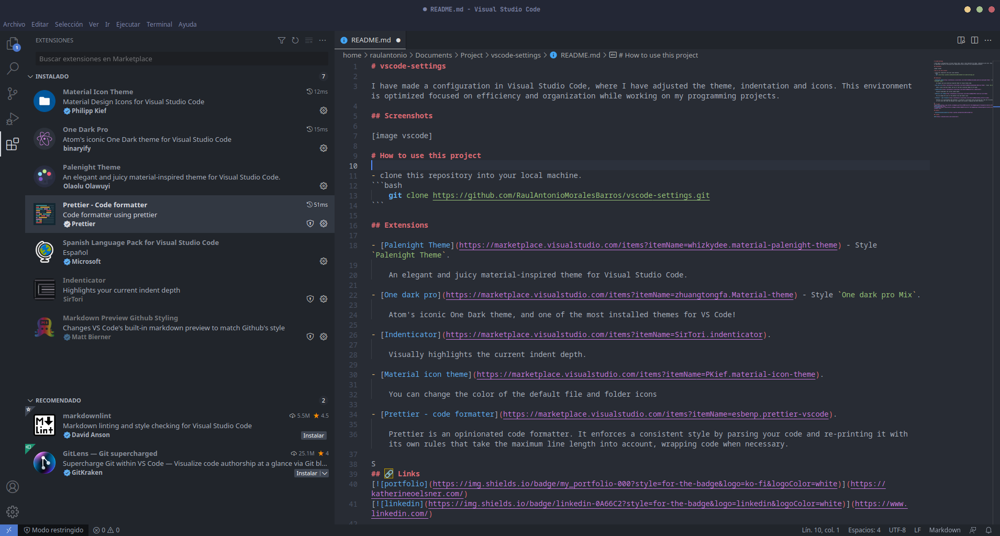

# vscode-settings

I have made a configuration in Visual Studio Code, where I have adjusted the theme, indentation and icons. This environment is optimized focused on efficiency and organization while working on my programming projects.

## Screenshots



# How to use this project

- clone this repository into your local machine.
```bash
    git clone https://github.com/RaulAntonioMoralesBarros/vscode-settings.git
```

## Extensions

- [Palenight Theme](https://marketplace.visualstudio.com/items?itemName=whizkydee.material-palenight-theme) - Style `Palenight Theme`.

    An elegant and juicy material-inspired theme for Visual Studio Code.

- [One dark pro](https://marketplace.visualstudio.com/items?itemName=zhuangtongfa.Material-theme) - Style `One dark pro Mix`.

    Atom's iconic One Dark theme, and one of the most installed themes for VS Code!

- [Indenticator](https://marketplace.visualstudio.com/items?itemName=SirTori.indenticator).

    Visually highlights the current indent depth.

- [Material icon theme](https://marketplace.visualstudio.com/items?itemName=PKief.material-icon-theme).

    You can change the color of the default file and folder icons

- [Prettier - code formatter](https://marketplace.visualstudio.com/items?itemName=esbenp.prettier-vscode).

    Prettier is an opinionated code formatter. It enforces a consistent style by parsing your code and re-printing it with its own rules that take the maximum line length into account, wrapping code when necessary.

## 🔗 Links
[](https://katherineoelsner.com/)
[](https://www.linkedin.com/)

## Authors

- [@raulantoniomoralesbarros](https://github.com/RaulAntonioMoralesBarros)

## License

[MIT](https://choosealicense.com/licenses/mit/)
